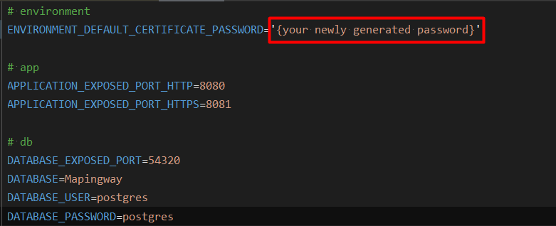

# Mapingway API

Backend application for travel routes managing

## Deployment

### Local development environment:

You can start up using `docker compose up` and compose.yaml file for Docker from **./docker/** directory context.

### Prerequisites:

**✔ Installed Docker Desktop/Engine.**

**✔ HTTPS SSL certificate.**

To enable HTTPS on local machine you need to:

1. Generate random string password for your local database.
2. Create SSL certificate and trust it for local devs:
   ```
   dotnet dev-certs https --trust -ep $env:USERPROFILE\.aspnet\https\Mapingway.API.pfx -p {your generated password}
   ```
3. Update the **.env** file with newly generated password:
